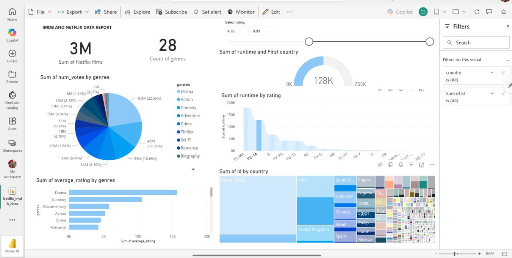

# Netflix-and-IMDb-Data-Analysis-and-Recommendation-System
Datasets analysis with Jupyter Notebook and creating ML models for prediction and recommendations

📘 Proiecte incluse

Netflix_movies_analysis.ipynb

  Acest notebook realizează o analiză exploratorie a datelor (EDA) pe un set de date cu filme și seriale de pe Netflix.
  1. Se curăță și se preprocesează datele (eliminare valori lipsă, conversii de tipuri).
  2. Se efectuează analize descriptive: distribuția filmelor după ani, țări, genuri, durată etc.
  3. Se vizualizează tendințele folosind grafice (histograme, countplots, word clouds).
  4. Scopul este înțelegerea patternurilor din conținutul Netflix și a preferințelor publicului.

rec_tf_idf_similarity.ipynb
  Acest notebook implementează un sistem de recomandare bazat pe TF-IDF (Term Frequency–Inverse Document Frequency) și similaritatea cosinus.
  1. A fost preprocesat un set de date cu filme.
  2. Descrierile au fost transformate în vectori TF-IDF.
  3. S-a calculat similaritatea între filme pentru a recomanda titluri similare pe baza conținutului (content-based filtering).

Rezultatul final: pentru un film selectat, se obțin automat filme similare după descriere, gen sau cuvinte-cheie.

